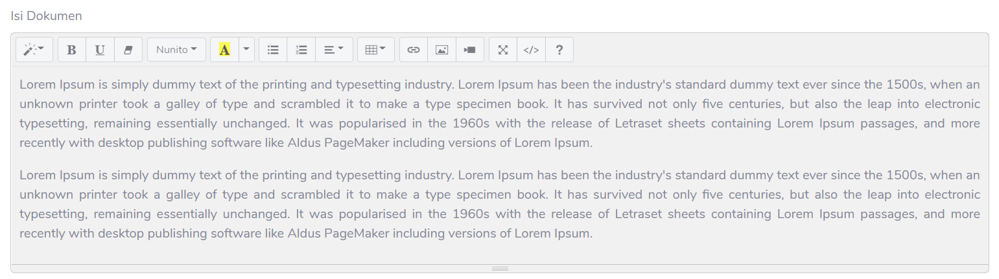

# Proyek Tengah Semester [HCI-HRIS](https://proyek-hci-hris.herokuapp.com)

## Anggota Kelompok
1. Muhammad Sulton Tauhid (1606905885) **KETUA**
2. Eko satria (1706043185)
3. Alwan Fadhil (1706103461)

## Deskripsi tugas proyek
Membuat sistem frontend Human Resources Information System

## Penjelasan umum
Proyek ini adalah sistem frontend yang dapat digunakan untuk sistem perusahaan atau sistem civitas akademika kampus yang berfungsi sebagai sistem admin. Sistem ini dapat memasukkan informasi berupa dokumen dengan disediakan Textview agar user dapat melakukan input dan menunjukkan hasil dokumennya pada card yang disediakan.

Aplikasi ini penting karena aplikasi ini dapat merekam informasi berupa dokumen penting. Misalnya, pada suatu perusahaan dibutuhkan pencatatan dokumen secara daring, maka sistem admin ini dapat memasukkan dokumen dan melihatnya.

## Filosofi UI/UX
### Warna
Sistem ini menggunakan __theme color__ berwarna __steelblue__ dengan kode **hex #5165af**. Warna ini memiliki arti **profesionalitas**.

### Komponen
Sistem ini secara dominan menggunakan komponen __cards__,__button__, __formatted textfield__, __charts__ dan __table__ untuk menampilkan informasi penting. Tujuannya dari kelima komponen tersebut adalah fleksibilitas dan tampilan yang kekinian.

#### Komponen formatted textfield

#### Komponen button

#### Komponen cards

#### Komponen charts

#### Komponen tables

## Fitur halaman
Fitur halaman yang disediakan terdiri dari 5 fitur utama:
1. Dashboard
2. Ringkasan
3. Riwayat
4. Dokumen
5. Kegiatan

## Cara Menggunakan (localhost)
1. Pindah terlebih dahulu ke **branch development**
2. Lakukan **git clone** pada repositori branch development
3. Lakukan **[npm](https://nodejs.org/en/download/) install** di dalam directory folder proyek ini
4. Setelah folder **node_modules terinstall**, lakukan **npm run start** pada command prompt atau CLI untuk memulai localhost development
5. Sistem frontend berhasil dijalankan

## Tech Stack yang digunakan
1. HTML5
2. Bootstrap 4
3. Javascript -> GulpJs, NodeJs dan Browsersync.Js
